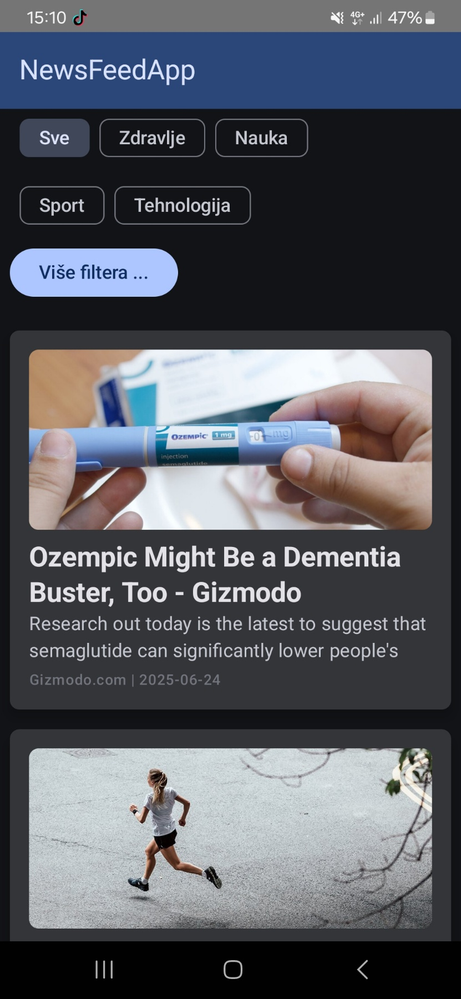
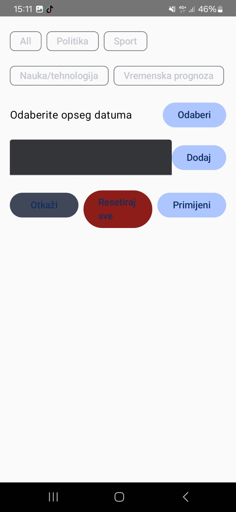

# NewsFeed Compose App

🔗 **Original Repository:**  
https://bitbucket.org/nomanovci3/rma25projekat-19655/src/master/

---

## Application Preview

  
  

---

## Description

Android news application built with Kotlin and Jetpack Compose.  
The app fetches news articles from a REST API and allows users to browse and filter news by category.

---

## Features

- Fetch news from REST API
- Category-based filtering
- Modern UI with Jetpack Compose
- Async data loading
- Clean architecture structure

---

## Tech Stack

- Kotlin
- Jetpack Compose
- MVVM Architecture
- Retrofit
- Coroutines
- Android Studio

---

## What I Learned

- Building Android apps using Jetpack Compose
- API integration with Retrofit
- MVVM architecture implementation
- State management in Compose
